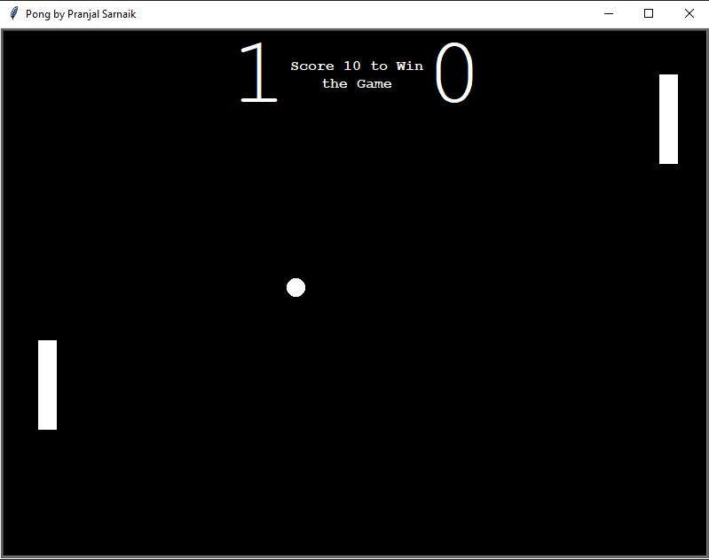
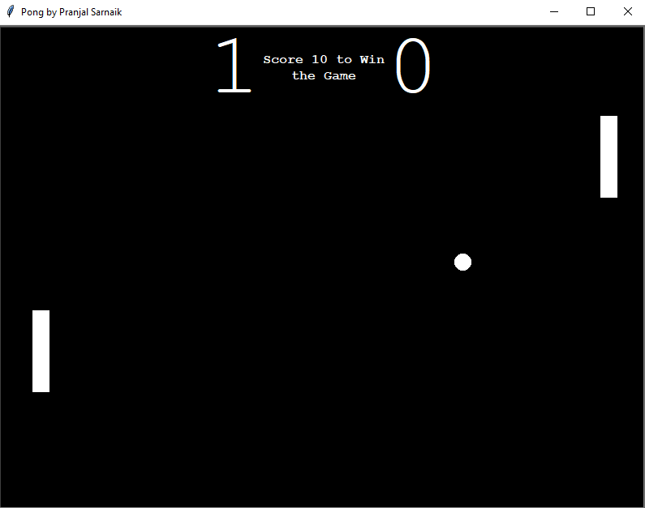
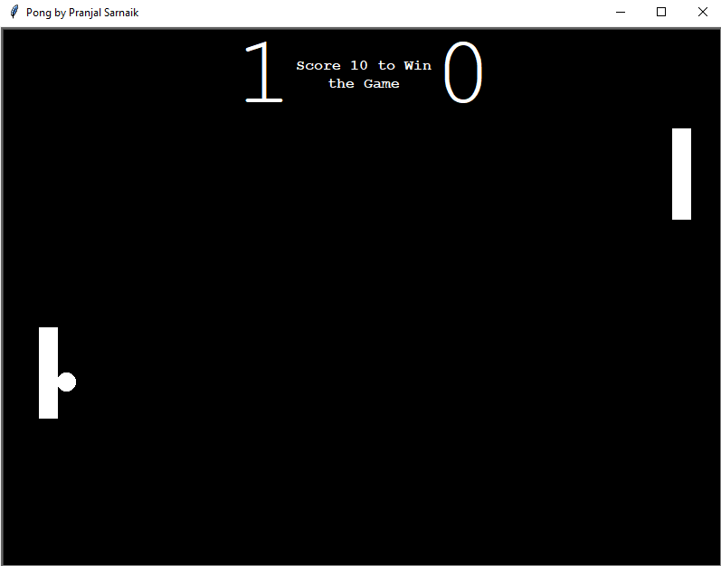

# Pong Game
A classic Pong game built using Python’s `turtle` and `time` modules with an OOP approach. Two players compete to reach a winning score of 10. 

## Screenshots
, , 

## Author
Pranjal Sarnaik

## Features
- **Dynamic Ball Speed:** Increases on paddle collision, decreases when missed.  
- **Player Controls:** Left paddle (`W`/`S`), Right paddle (`O`/`L`).  
- **Scoreboard:** Displays current scores.  
- **Winning Message:** Shown when a player reaches 10 points.  
- **Screenshots Folder:** Stores gameplay snapshots.  

## Level
Intermediate

## Tech Stack
Python | OOP | Turtle Graphics | Game Logic | Event Handling  

## How to Run
1. Clone the repo:  
   ```bash  
   git clone https://github.com/pranjalco/pong-game-intermediate.git

3. Run:
    ```bash  
   python app.py

**Created by Pranjal Sarnaik**  
*Released under the MIT License*